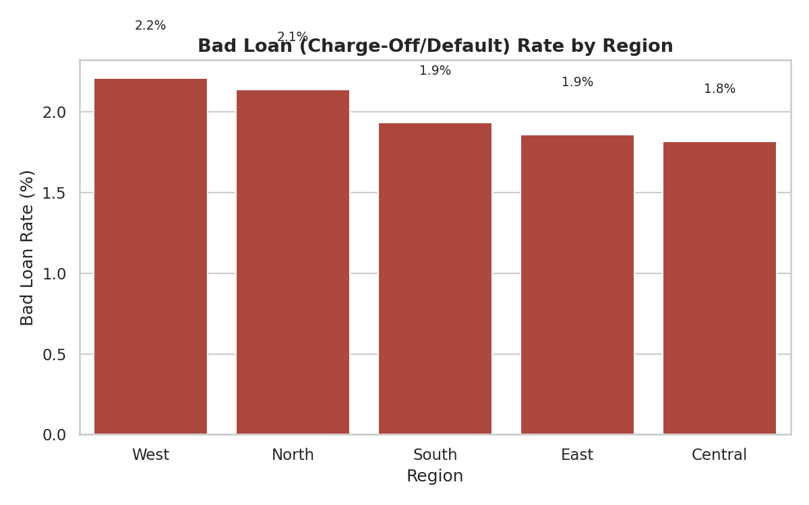
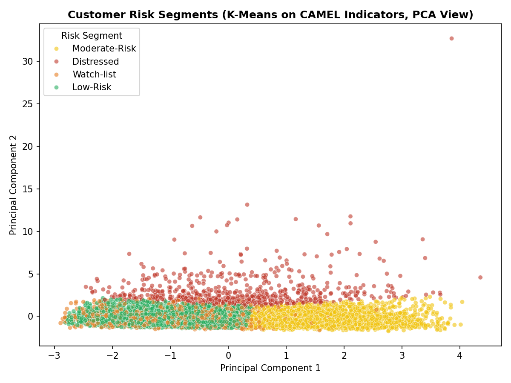
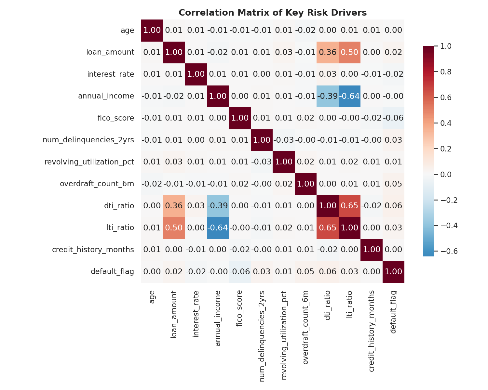
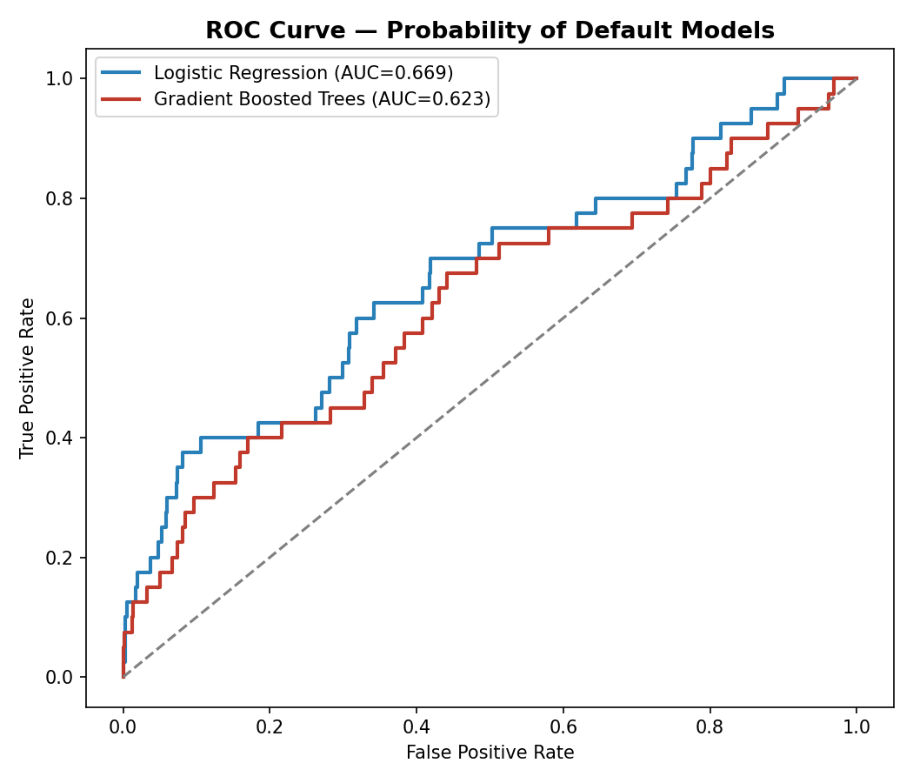
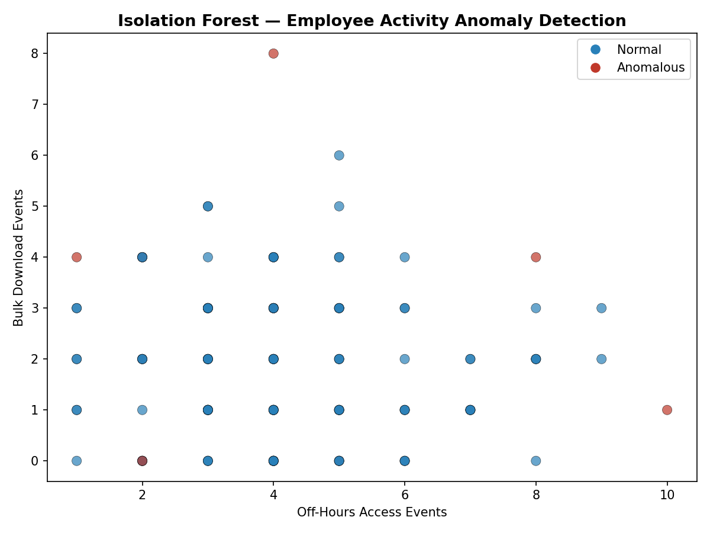

# 🏦 Enterprise Early Warning Risk Monitoring System (EWRMS)

**A proactive, data-driven early warning system for bank loan portfolios — moving risk
management from reactive to forward-looking.**


---

## 📌 1. Project Objective

To design and implement a proactive, data-driven early warning system that monitors a
bank's loan portfolio and operational activities, identifies emerging **credit,
operational, and fraud risks** before they materialize into significant losses, and
enables management to take timely, preventive action.

This project transitions the institution from **reactive** risk management to a
strategy built on **forward-looking, risk-based insights** — combining SQL, Python,
Power BI, and Excel into one end-to-end analytics lifecycle.

> ⚠️ **Data disclaimer:** This repository uses a fully **synthetic** loan portfolio
> (`data/loan_data_raw.csv`, generated by `python/00_generate_synthetic_data.py`).
> No real customer, employee, or bank data is used anywhere in this project. The
> synthetic generator was built to reproduce realistic relationships (e.g. higher
> DTI and lower FICO correlating with higher default risk) so that the EDA and
> modeling steps behave the way they would on a real portfolio.

---

## 🗂️ 2. Repository Structure

```
Enterprise-Early-Warning-Risk-Monitoring-System/
│
├── README.md                              <- you are here
├── requirements.txt                        <- Python dependencies
├── LICENSE
├── .gitignore
│
├── data/
│   └── loan_data_raw.csv                   <- synthetic raw loan portfolio extract
│
├── sql/
│   ├── 01_create_schema.sql                <- data warehouse schema (DDL)
│   ├── 02_data_cleaning_and_features.sql    <- SQL-native cleaning + feature build
│   └── 03_kpi_queries.sql                   <- KPI query library for BI tools
│
├── python/
│   ├── 00_generate_synthetic_data.py        <- synthetic data generator
│   ├── 01_data_cleaning.py                  <- missing values, dedup, standardization
│   ├── 02_feature_engineering.py            <- DTI, LTI, credit history, FICO buckets
│   ├── 03_eda.py                            <- univariate/bivariate/multivariate EDA
│   ├── 04_risk_segmentation_kmeans.py        <- K-Means CAMEL-style risk segmentation
│   ├── 05_predictive_model.py               <- Logistic Regression + GBM PD model
│   └── 06_anomaly_detection.py              <- Isolation Forest fraud/ops monitoring
│
├── outputs/
│   ├── images/                              <- all charts generated by the pipeline (12 PNGs)
│   ├── processed_data/                      <- cleaned, engineered, scored CSV outputs
│   └── EWRMS_KPI_Dashboard.xlsx             <- formula-driven Excel KPI summary
│
└── dashboard/
    └── PowerBI_Dashboard_Notes.md            <- Power BI page-by-page architecture + DAX
```

---

## 🧭 3. Methodology & Analytics Workflow

### Phase 1 — Data Engineering & Preparation (SQL, Python, Excel)
- **Ingestion:** loan, transactional, and external data land in a centralized SQL
  data warehouse (`sql/01_create_schema.sql`).
- **Cleaning:** missing values imputed by cohort median, duplicates removed, formats
  standardized (`python/01_data_cleaning.py`, `sql/02_data_cleaning_and_features.sql`).
- **Feature Engineering:**
  - `credit_history_months = (issue_date − earliest_credit_line)`
  - `dti_ratio` (Debt-to-Income), `lti_ratio` (Loan-to-Income)
  - `loan_status_group` (`Good` = Fully Paid/Current, `Bad` = Charged Off/Default)
  - `fico_bucket` (Poor → Excellent)

### Phase 2 — EDA & Model Development (Python)
- **EDA:** distribution, correlation, and trend analysis (`python/03_eda.py`).
- **Risk Segmentation:** K-Means clustering on CAMEL-style indicators (DTI, liquidity
  proxy, cost-to-income proxy, delinquencies, FICO) groups customers into **Low-Risk →
  Distressed** segments (`python/04_risk_segmentation_kmeans.py`).
- **Predictive Modeling:** Logistic Regression (interpretable baseline) and a
  Gradient Boosted Trees model produce a **0–100 Risk Score** usable as a real-time
  scoring engine (`python/05_predictive_model.py`).
- **Anomaly Detection:** Isolation Forest flags suspicious employee activity — e.g.
  off-hours system access and bulk data downloads (`python/06_anomaly_detection.py`).

### Phase 3 — Dashboard & Reporting (Power BI, Excel)
- Interactive **Power BI** dashboard architecture across 5 pages for different
  personas (Executive, Risk Committee, Analysts, Relationship Managers, Audit) — see
  [`dashboard/PowerBI_Dashboard_Notes.md`](dashboard/PowerBI_Dashboard_Notes.md).
- A formula-driven **Excel KPI workbook** (`outputs/EWRMS_KPI_Dashboard.xlsx`) for
  quick reference, ad-hoc analysis, and offline sharing.

---

## 📊 4. Key Results (from the synthetic demo dataset, n = 8,000 loans)

| Metric | Value |
|---|---|
| Total loans analyzed | 8,000 |
| Total portfolio value | ₹44.06 Cr (440,592,100) |
| Overall bad-loan rate | 2.0% |
| Customers in "Distressed" risk segment | 660 (8.25%) |
| Best model ROC-AUC (Probability of Default) | ~0.62–0.67 (GBM / Logistic Regression) |
| Employees flagged for anomalous activity | 9 of 120 (7.5%) |

> Model performance numbers reflect a deliberately noisy synthetic dataset with a
> realistic, imbalanced ~2% default rate — the same class-imbalance challenge you'll
> see on a real loan book. The pipeline (train/test split, ROC-AUC, confusion matrix,
> feature importance) is fully production-ready; point it at real, larger, and more
> feature-rich historical data and both discrimination and calibration improve.

### Sample outputs

**Regional risk exposure**



**Customer risk segmentation (K-Means)**



**Correlation of key risk drivers**



**Probability-of-default model performance**



**Operational anomaly detection**



*(All 12 charts are available in [`outputs/images/`](outputs/images/), including
FICO distribution, DTI-vs-status, loan purpose breakdown, monthly bad-loan trend,
elbow method, feature importance, and confusion matrix.)*

---

## 📈 5. KPI Tracking Framework

| Category | KPI | Role |
|---|---|---|
| Portfolio Health | Default / Charge-Off Rate | Lagging — core loss measure |
| Portfolio Health | Good Loan / Bad Loan % | Snapshot of asset quality |
| Portfolio Health | Average Interest Rate | Lagging — revenue & risk-taking signal |
| Borrower Risk | Debt-to-Income (DTI) Ratio | Leading — repayment capacity |
| Borrower Risk | Credit Score / FICO Bucket | Leading — primary creditworthiness predictor |
| Borrower Risk | Loan-to-Income (LTI) Ratio | Leading — over-leverage indicator |
| Borrower Risk | Risk Score (model output, 0–100) | Leading — core early-warning signal |
| Operational & Financial | Cost-to-Income Ratio (CIR) | Leading — management efficiency |
| Operational & Financial | Net Interest Margin (NIM) | Core profitability measure |
| Operational & Financial | Liquidity Ratios | Leading — short-term obligation coverage |
| Fraud & Anomaly | Anomaly Detection Alerts | Leading — financial crime / internal fraud prevention |

Full definitions, calculation logic, and formulas live in
[`sql/03_kpi_queries.sql`](sql/03_kpi_queries.sql) (SQL) and
[`outputs/EWRMS_KPI_Dashboard.xlsx`](outputs/EWRMS_KPI_Dashboard.xlsx) (Excel/DAX-style).

---

## 🛠️ 6. Technology Stack

| Tool | Application in this project |
|---|---|
| **SQL** | Data warehouse schema, cleaning, feature derivation, KPI queries |
| **Python** (Pandas, scikit-learn, Matplotlib, Seaborn) | Cleaning, EDA, feature engineering, K-Means segmentation, PD modeling, anomaly detection |
| **Power BI** | Multi-page interactive dashboard, DAX measures, What-If scenario modeling |
| **Excel** (openpyxl) | Formula-driven KPI summary workbook for quick sharing |

---

## ▶️ 7. How to Run This Project

```bash
# 1. Clone the repository
git clone https://github.com/<your-username>/Enterprise-Early-Warning-Risk-Monitoring-System.git
cd Enterprise-Early-Warning-Risk-Monitoring-System

# 2. Install dependencies
pip install -r requirements.txt

# 3. Run the full pipeline, in order
python python/00_generate_synthetic_data.py     # (optional) regenerate the demo dataset
python python/01_data_cleaning.py
python python/02_feature_engineering.py
python python/03_eda.py
python python/04_risk_segmentation_kmeans.py
python python/05_predictive_model.py
python python/06_anomaly_detection.py

# 4. (Optional) Load the SQL scripts into PostgreSQL / SQL Server
psql -f sql/01_create_schema.sql
psql -f sql/02_data_cleaning_and_features.sql
psql -f sql/03_kpi_queries.sql

# 5. Open outputs/EWRMS_KPI_Dashboard.xlsx for the Excel KPI summary,
#    or follow dashboard/PowerBI_Dashboard_Notes.md to rebuild the Power BI report.
```

Each script prints its key results to the console and writes its output
(CSV, PNG, or XLSX) to `outputs/`, so the pipeline is fully reproducible end-to-end.

---

## 📦 8. Deliverables

- ✅ **Reproducible data pipeline** — documented Python scripts + SQL queries for
  cleaning, feature engineering, and reporting hand-off.
- ✅ **Power BI dashboard architecture** — Executive Summary, Loan Portfolio Risk
  Monitoring, Risk Driver Analysis (What-If), Borrower Risk Profile, and Operational
  & Fraud Monitoring pages, fully specified in `dashboard/PowerBI_Dashboard_Notes.md`.
- ✅ **Predictive models & risk scores** — trained Python models (Logistic Regression,
  Gradient Boosted Trees) assigning a 0–100 risk score to every customer, forming the
  core of the early-warning mechanism.
- ✅ **KPI tracking framework** — a documented set of leading/lagging KPIs with SQL and
  Excel calculation logic and an interpretation guide for early risk detection.

---

## 🔭 9. Possible Extensions

- Swap `GradientBoostingClassifier` for **XGBoost** or **LightGBM** in production
  (the code is written as a drop-in swap — see the note at the top of
  `python/05_predictive_model.py`).
- Add **SHAP** values for individual-loan explainability alongside the risk score.
- Stream the model into a real-time scoring API (FastAPI/Flask) for point-of-
  origination decisioning.
- Backtest the risk-score bands against actual roll-rates once real historical
  outcomes are available.

---

## 📄 License

This project is licensed under the [MIT License](LICENSE).
